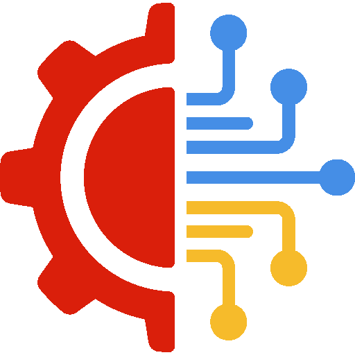
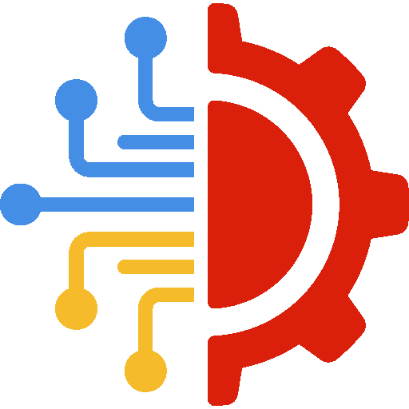

  
  &nbsp;&nbsp;&nbsp;
  
  &nbsp;&nbsp;&nbsp;
  

  

<h3 align="center">
   Hi, I'm Petro!
</h3>

  

  🔭 Working at <b>UARO</b> as a volunteer 
  🌱 Learning <b>Go</b> 
  ⚡ Passionate about <b>Ham Radio & Cybersecurity</b> 
  🌐 Visit me at: <a href="https://cyberdev.space">cyberdev.space</a>

  
  

<h2 align="center">🧠 Tech Stack</h2>

  

<table align="center" cellpadding="6">
  <!-- Backend -->
  <tr><th colspan="4" align="center">⚙️ Backend</th></tr>
  <tr>
    <td align="center">
       
       
       
      
    </td>
    <td align="center">
       
      
    </td>
    <td align="center">
       
       
      
    </td>
    <td align="center">
       
       
      
    </td>
  </tr>

  <!-- Frameworks -->
  <tr><th colspan="4" align="center">🧩 Frameworks</th></tr>
  <tr>
    <td align="center">
       
       
      
    </td>
    <td align="center">
       
      
    </td>
    <td align="center" colspan="2">
       
      
    </td>
  </tr>

  <!-- Databases -->
  <tr><th colspan="4" align="center">🗄️ Databases & Queues</th></tr>
  <tr>
    <td align="center">
       
      
    </td>
    <td align="center">
       
      
    </td>
    <td align="center">
       
      
    </td>
    <td align="center">
      
    </td>
  </tr>

  <!-- DevOps -->
  <tr><th colspan="4" align="center">🚀 DevOps & Infrastructure</th></tr>
  <tr>
    <td align="center">
       
      
    </td>
    <td align="center">
       
      
    </td>
    <td align="center">
       
      
    </td>
    <td align="center">
       
       
      
    </td>
  </tr>

  <!-- Frontend -->
  <tr><th colspan="4" align="center">🎨 Frontend</th></tr>
  <tr>
    <td align="center">
       
      
    </td>
    <td align="center">
       
      
    </td>
    <td align="center">
       
      
    </td>
    <td align="center">
      
    </td>
  </tr>

  <!-- Tools -->
  <tr><th colspan="4" align="center">🧰 Tools & IDEs</th></tr>
  <tr>
    <td align="center">
       
      
    </td>
    <td align="center">
       
      
    </td>
    <td align="center">
       
      
    </td>
    <td align="center">
       
      
    </td>
  </tr>

  <!-- OS -->
  <tr><th colspan="4" align="center">💾 Operating Systems</th></tr>
  <tr>
    <td align="center">
       
      
    </td>
    <td align="center">
       
      
    </td>
    <td align="center">
       
      
    </td>
    <td align="center">
      
    </td>
  </tr>

  <!-- Cyber -->
  <tr><th colspan="4" align="center">🕶️ Cyber & Security</th></tr>
  <tr>
    <td align="center" colspan="2">
      
    </td>
    <td align="center" colspan="2">
      
    </td>
  </tr>
</table>

  

  

<i>“Hack the planet, but keep it ethical 🌍”</i>

<i>Updated on: 2025-12-25 21:00:01</i>

